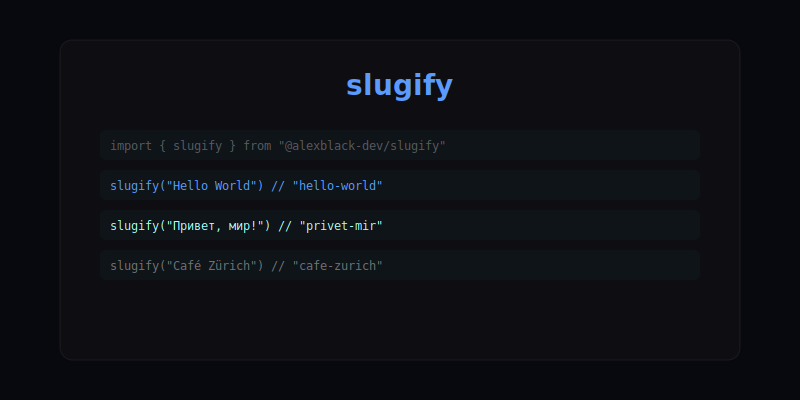

# slugify



Transliterate and slugify strings - Cyrillic, Latin, Unicode normalisation.

## Install

```bash
npm install @alexblack-dev/slugify
```

## Usage

```ts
import { slugify } from '@alexblack-dev/slugify'

slugify('Hello World')           // 'hello-world'
slugify('Привет, мир!')          // 'privet-mir'
slugify('Café Zürich')           // 'cafe-zurich'
slugify('  multi   space  ')     // 'multi-space'
slugify('___foo___bar___')       // 'foo-bar'
```

### Options

```ts
slugify('Hello World', { separator: '_' })          // 'hello_world'
slugify('Hello World', { lowercase: false })        // 'Hello-World'
slugify('Hello   World', { maxConsecutive: 1 })      // 'hello-world'
```

## API

### slugify(input, options?)

| Option | Type | Default | Description |
|--------|------|---------|-------------|
| separator | string | '-' | Separator between words |
| lowercase | boolean | true | Convert to lowercase |
| maxConsecutive | number | 1 | Max consecutive separators |

### transliterate(input)

```ts
import { transliterate } from '@alexblack-dev/slugify'

transliterate('Привет')  // 'Privet'
transliterate('Čeština') // 'Cestina'
```

## License

MIT (c) [Alex Black](https://github.com/AlexBlack-Dev)
